# **Dogpack**
#### Video Demo:  <URL HERE> [Dogpack](https://youtu.be/NOYBgV6GItI)
#### Description:
Hi. Welcome to my CS50x final project called ***Dogpack***. It is a social media website *(more like of a facebook and instagram combined)*. The reason why I made this is because I want a *socmed website* exclusive to my group of friends. 

In this project, I am using Python Flask for the backend, HTML, CSS (purely css, no Bootstrap) ,and JavaScript for the frontend, and SQLite3 for the database.  

 So, without further ado, let me take you guys on a tour of ***Dogpack***. 

## **LOGIN**
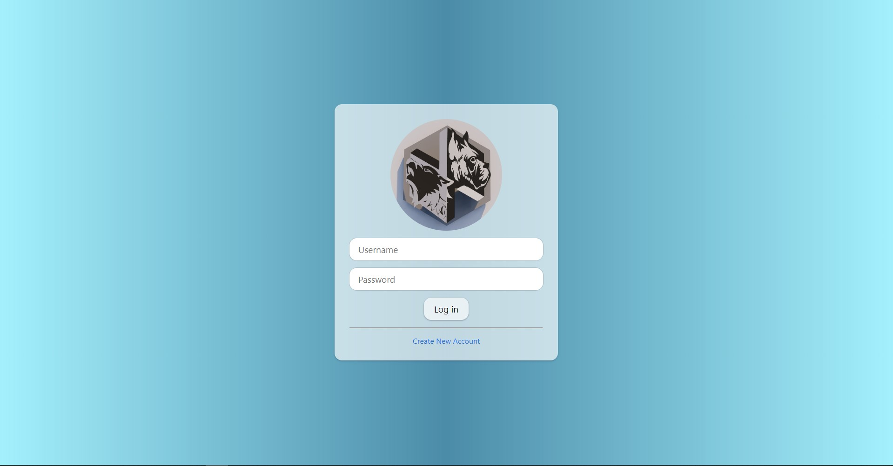  
This is the login page. This website requires the user to have an account to log in. It will ask the correct username and password of the user. Failing to do so will show the user errors. *See pictures below.*

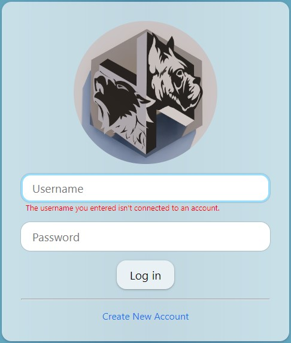  
An error will show below the **username input field** due to the following reasons:  
1. Username submitted was blank *(empty).*  
2. Username submitted was unregistered.<br><br>
  
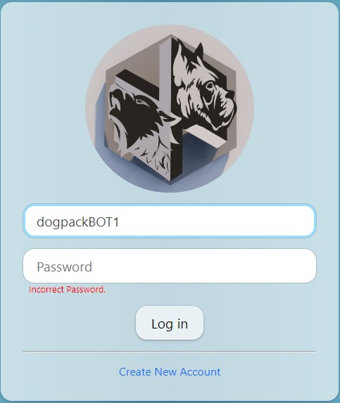  
An error will show below the **password input field** if the password submitted was incorrect.<br><br>
A successful log in will bring the user to the *Homepage*.
## **REGISTER**
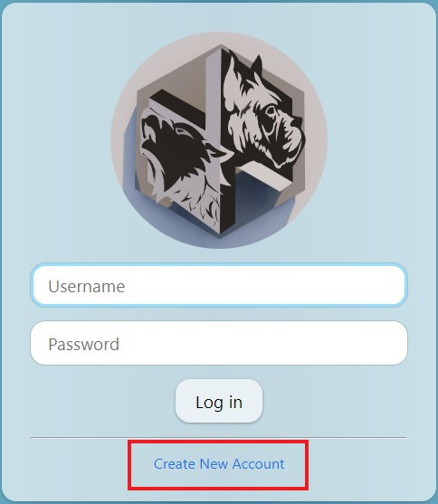  
Clicking ***Create New Account*** will bring you to the registration page, showing you the registration form.  

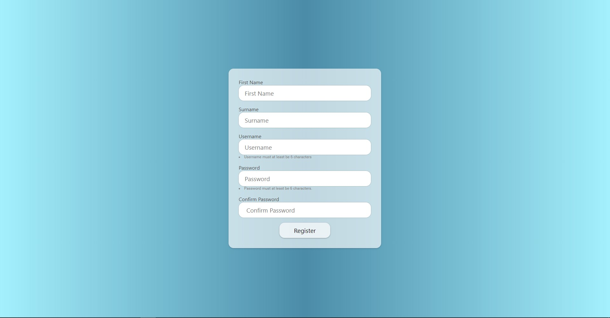  
This is the registration page. The website will ask the user for the following:  

*1. First name  
2. Surname  
3. Username  
4. Password  
5. Confirmation Password*  

Take note that there is a specific requirement for filling up the *username* and *password*.
* Username must at least be 6 characters.
* Username must not already exist.
* Password must at least be 6 characters.  

Failing to do so will show the user *errors*. *See pictures below*.  

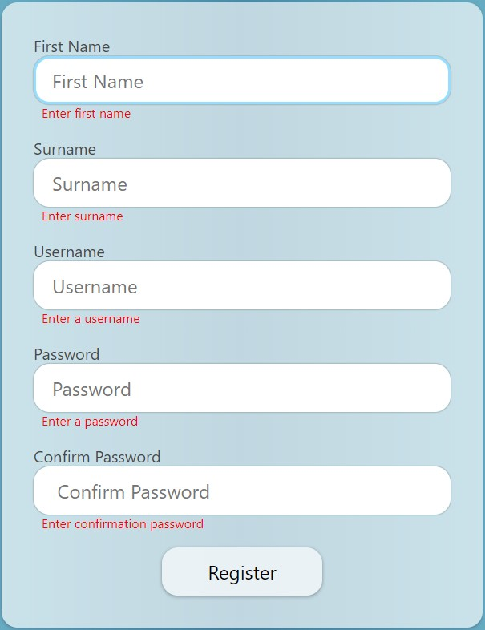  
The errors will specify which input field was not filled by the user when the *register* button was pressed.<br><br>

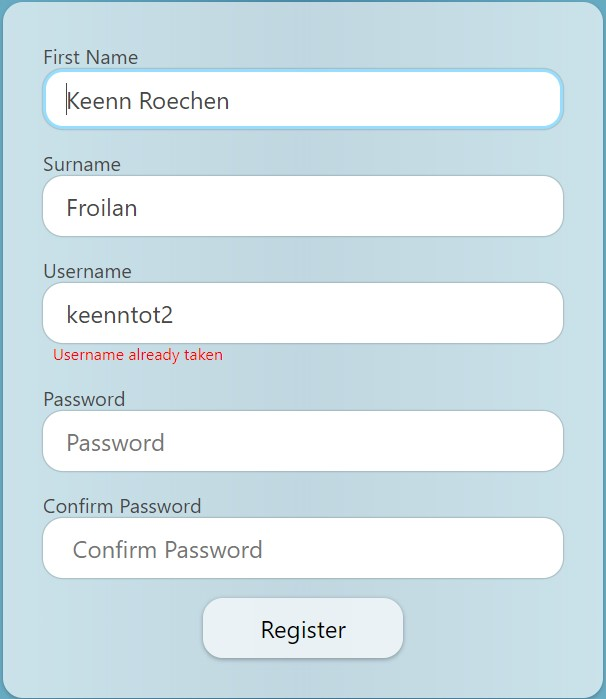  
An error will indicate that the username submitted by the user already exists. The user must use a unique username.<br><br>

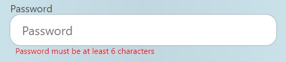  
An error will indicate that the password submitted was no longer than 6 characters.
The minimum required characters for the *password* must at least be 6 characters.<br><br> 

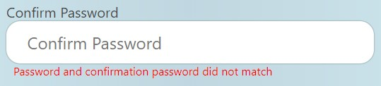  
An error will indicate that the confirmation password submitted did not match with the characters in the *password input field*.<br><br>

If the registration is successful, information in the input fields will be saved into the database. A directory for photos and profile photos of the user will be created. A session will be created, allowing the user to log in. *See the code block below*.

**NOTE**: Storing non-hashed passwords in the database is strictly prohibited because it can compromise security. In this case, I used the *generate_password_hash* function from *werkzeug.security* library to hash the password before saving it to the database.

``` python
# If there are no errors, store information to database
db.execute("INSERT INTO accounts (firstname, surname, username, password, date, time) VALUES (?,?,?,?,?,?)", firstname, surname, username, password_hashed, datetoday(), timenow())
# Create Session and directory for photos
id = db.execute("SELECT * FROM accounts WHERE username = ?", username)
os.mkdir(f"static/images/{id[0]['id']}")
os.mkdir(f"static/images/profile_pic/{id[0]['id']}")
session["user_id"] = id[0]["id"]
```

## **HOMEPAGE**  
  
When the user first log in to *Dogpack*, the user will land on the home page. This is where the user see posts from other users. You can like and comment posts from here. 

The navigation sidebar will always be there to help the user navigate in *Dogpack*. All you can see in the navigation bar will bring you to the desired page in a click *(including the profile picture which can be found in the upper most part of the navigation bar)*.  


### **<u>POST</u>**

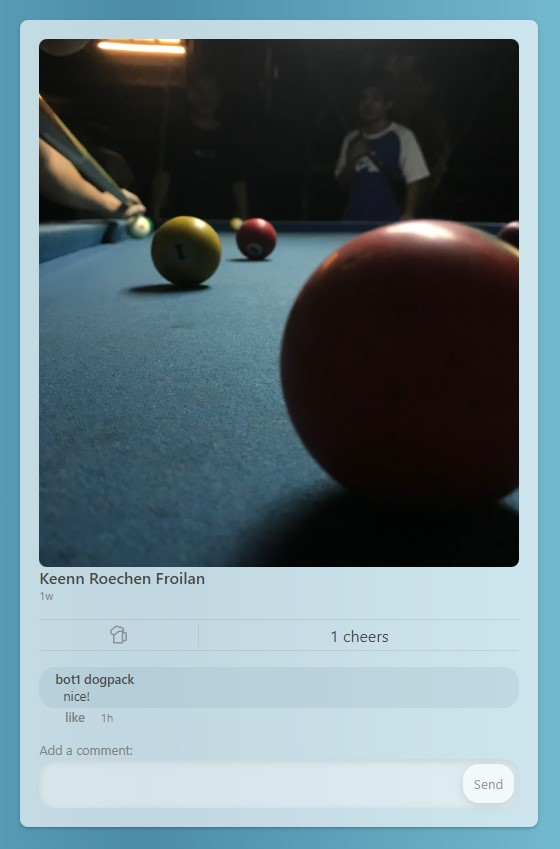  
This is what a *post* looks like in *Dogpack*. In it, you can see the following:  

* Photo
* Name of the user who posted
* Post timestamp
* Cheer button (similar to like button)  
* Beside the cheer button is the number of users who cheered (liked) the post
* Comment section  
    * Name of the user who commented
    * like button and comment timestamp
* Add a comment section
    * Comment input field which has a send button.<br><br>

**Flask - SocketIO**  
The *cheer button*, the *number of users who cheered* and the *comments* use Flask-SocketIO for real-time interaction among the users. When using Flask-SocketIO, there is no need to reload because real-time updates are delivered instantly to all users, creating a seamless and interactive user experience. So every time a user presses the *cheer button*, an update of the number of users who cheered will be broadcast among the users in real time. That also goes the same when a user comments on a post. When a user comments on a post, the comment will be broadcast among the users in *Dogpack*.  

**Asynchronous JavaScript and XML (AJAX)**  
The post and comment timestamps are updated at intervals of 5 seconds via AJAX.  
``` js
function fivesecondinterval() {
    setInterval(function(){
        aj = $.ajax({
            url: '/update-post-comment-time',
            type: 'GET',
            success: function(data) {
                $('.comment_time').each(function(i) {
                    commentTime_id = $(this).attr('id').replaceAll('commentTime', '')
                    $('#commentTime'+commentTime_id).text(data.time[commentTime_id])                                         
                })   

                $('.post_time').each(function(i) {
                    postTime_id = $(this).attr('id').replaceAll('postTime', '')
                    $('#postTime' + postTime_id).text(data.post_time[postTime_id])
                })
            }
        })
    }, 5000)  
}
```  
``` python
@app.route('/update-post-comment-time')
@login_required
def update_comment_time():
        post_q = """
            SELECT * FROM accounts
            JOIN posts ON posts.user_id = accounts.id
            ORDER BY post_date DESC, post_time DESC
        """
        comment_q = """
            SELECT *
            FROM comments
            JOIN accounts ON accounts.id = comments.user_id
            JOIN posts ON posts.post_id = comments.post_id
            ORDER BY post_id DESC, comment_date, comment_time
        """

        posts = db.execute(post_q)
        comments = db.execute(comment_q)

        comment_time = {}     
        post_time = {}        

        for row in comments:
            comment_time[row["comment_id"]] = (timeago(row['comment_date'], row['comment_time']))
            
        for row in posts:
            post_time[row['post_id']] = timeago(row['post_date'], row['post_time'])

        return jsonify({'time' : comment_time, 'post_time' : post_time})
```
Every five (5) seconds, an AJAX call will be made to retrieve data in JSON format from the specified URL (as shown in the first code block above). After the data has been successfully retrieved from the server, it will update the HTML content, replacing the current time.

When you examine the second code block, you can see how the data is retrieved. The *timeago* function (as referenced in the second code block) will determine how much time has passed since the user posted or commented. The function will return the elapsed time and will be recorded in a dictionary. These dictionaries will then be sent back in JSON format as a response to the AJAX call, providing the requested data.  

### **<u>DELETE POST</u>**
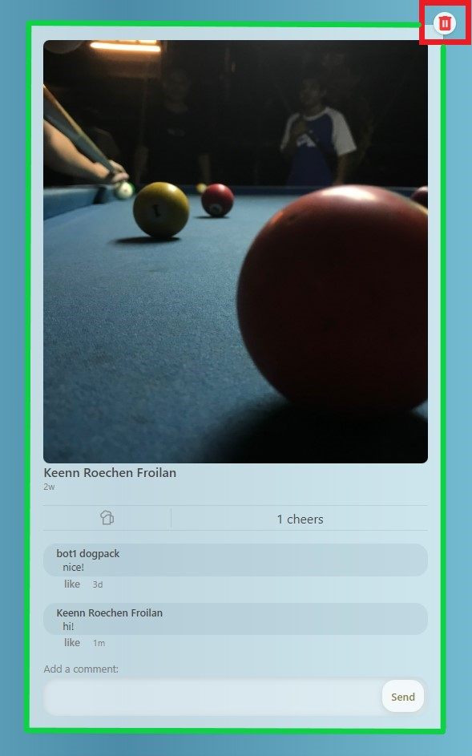  
When the cursor enters the user's own (who is Keenn Roechen Froilan in this case) *post division* (green box outline), the *delete* button (red box outline) will appear in the upper right corner of the *post*. Clicking the *delete* button will delete the post and automatically remove the *number of people who cheered*, the *comments*, and the *comment likes*, as I have set their *FOREIGN KEY* in the database to *ON DELETE CASCADE*.

Here's an explanation of how ON DELETE CASCADE works in the context of a SQLite3 database:  

1. Parent-Child Relationship: ON DELETE CASCADE is typically used in a parent-child relationship between two tables. The parent table has a primary key, and the child table has a foreign key that references the primary key of the parent table.

2. Deleting a Parent Row: When a row in the parent table is deleted, the database automatically enforces the cascade behavior. It will:  
    * Delete the row in the parent table.
    * Cascade the deletion to the child table by deleting any related rows in the child table where the foreign key references the primary key of the deleted row in the parent table.<br><br>

### **<u>DELETE COMMENT</u>**

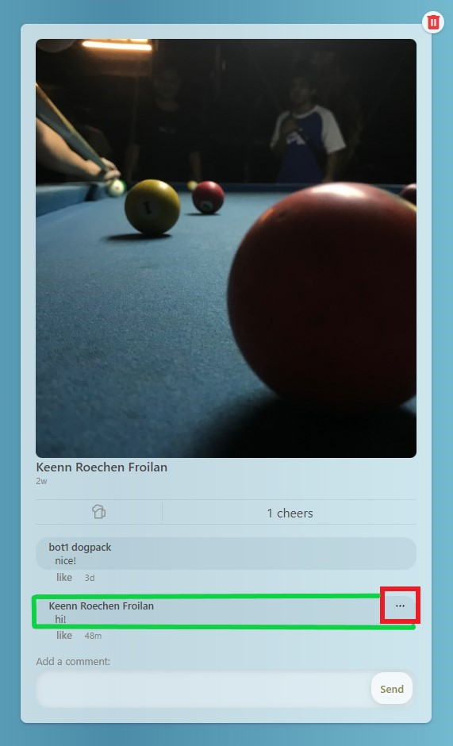
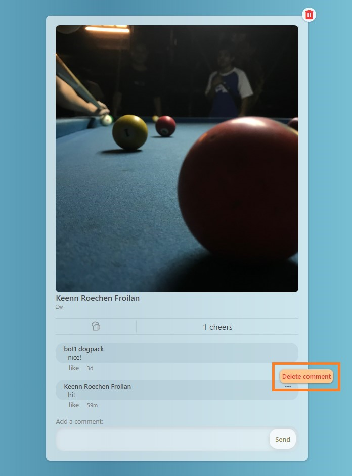

When the cursor enters the user's own (who is Keenn Roechen Froilan in this case) *comment division* (green box outline), the *more* button (red box outline) will appear in the upper right corner of the *comment division*. Clicking the *more* button will show the *Delete comment* button (orange box outline).

Clicking the *Delete comment* button will delete the specific comment.<br><br>  

## **PROFILE** 
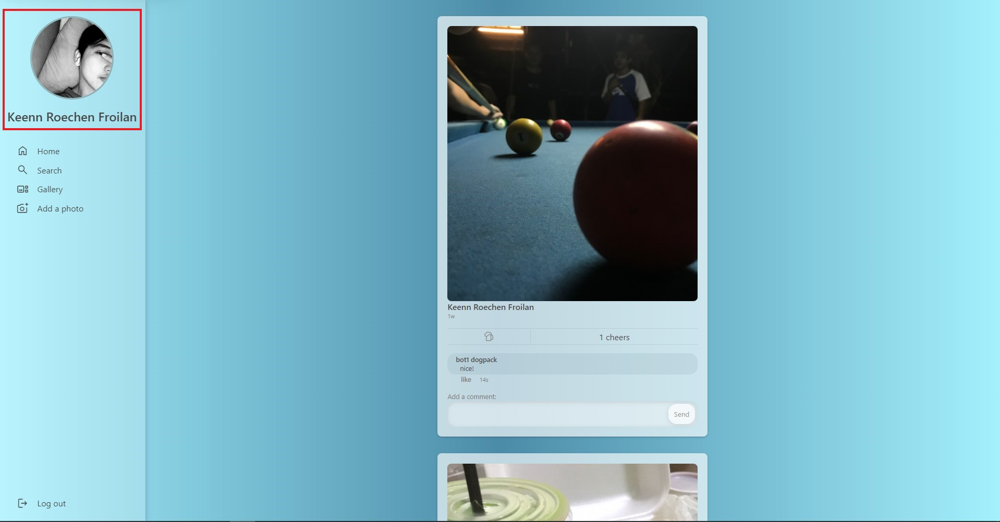  
To access your own *Profile* page, you can click either your *Profile Photo* or your *Name* (both of which are enclosed in a red box outline).<br><br>

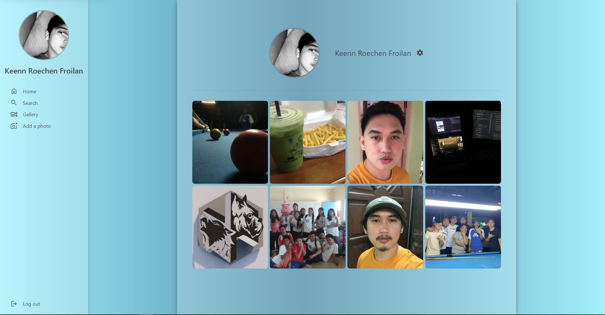  
This is the *Profile* page. Here, you can view all of your posts, which are arranged in reverse chronological order. You can also edit your *profile photo* and change your password via the settings on this page.<br><br>

### <u>Posts</u>  
  
When the cursor hovers over a post, an AJAX call will be made to retrieve information from the database. This information should provide data on the *number of comments* and *cheers* that the specific post being hovered over currently has. The retrieved data will then be dynamically inserted into the HTML, allowing the user to view the information.

For a more interactive user experience, the image *(post)* will enlarge slightly and display a box shadow when hovered over.

When you click on the image *(post)*, it will enlarge, allowing any user to comment on and like the post. *See the picture below*.

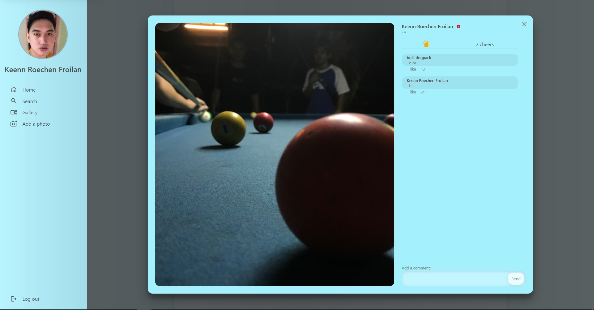  
Any actions done *(like or comment)* in this section will be broadcast among the users in real time.<br><br>

### <u>Change Profile Photo</u> 
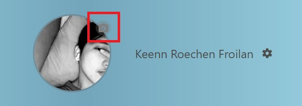  
When the cursor hovers over the *profile photo*, a *camera button* will appear. Clicking this button will prompt the user to upload a new *profile photo*.  

Note: The user can only apply changes on their **own** profile photo.

If the user has already selected a photo, an editing section will be displayed, allowing the user to crop the picture to their desired size. *See the photo below*.

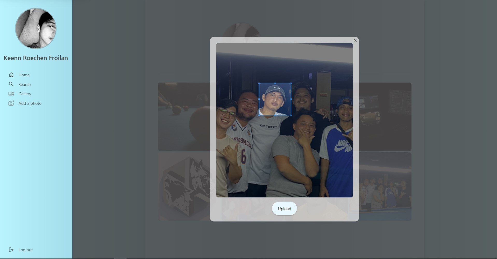  
This image cropping feature is imported from a JavaScript library called ***cropper.js***.  

The user has full control over the cropping box, which defines the area that will be prominently featured on their profile. They can adjust it by dragging, resizing, and even zooming in on the photo to achieve their desired profile picture.

After the user has finished cropping, they can click the *Upload* button to save the new profile photo to the profile photo directory, replacing the older one. The updated profile photo will then be displayed on the *profile* page.<br><br>

### <u>Settings</u> 
  
*Settings* can be found right beside the user's name in **their** *profile*. By clicking the *settings* button, options will pop up. *See the picture below*.  

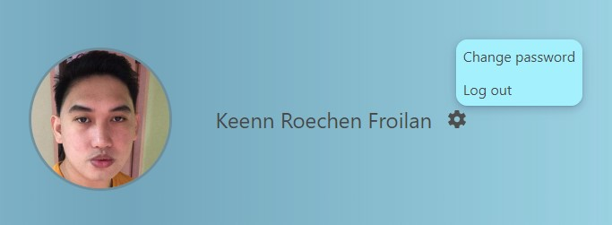  
Within the *settings*, you can change your password or you can choose to log out.<br><br>

### <u>Change Password</u>
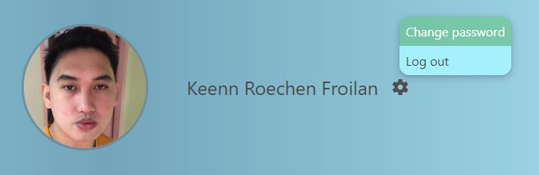  
Clicking *Change password* will take you to the password change page.<br><br>

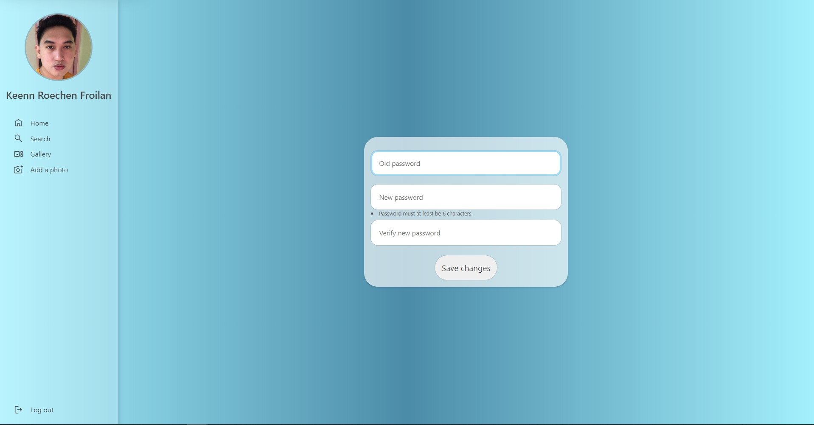
This is the password change page. To update the user's password, the user has to fill up the necessary information. 

It will ask the user for the following:  
1. Old password
2. New password
3. Confirmation password  

Failure to do so will result in errors (which can be found below each input field). *See the pictures below*.  

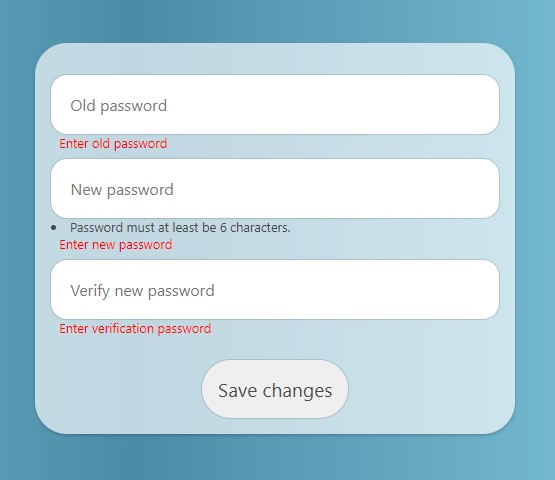  

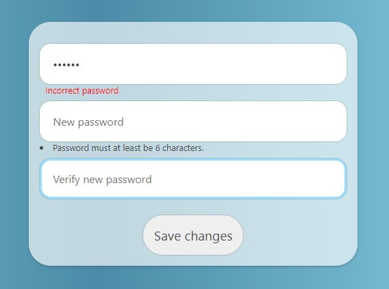  
If the user enters the incorrect old password, they will be notified.  

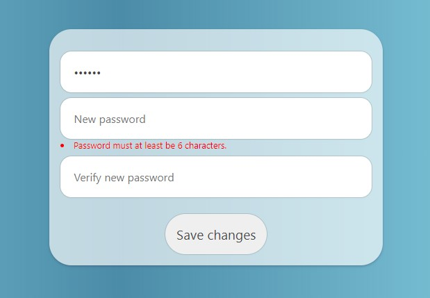  
If the user enters a *new password* with fewer than six characters, they will be notified that the password **must at least be 6 characters**.  

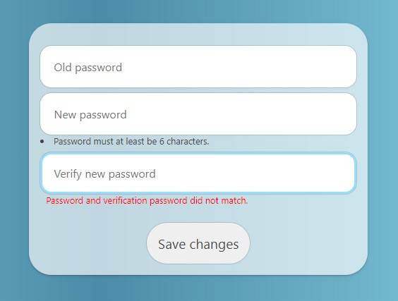  
Lastly, if the *new password* and *verification password* entered do not match, the user will be notified.<br><br>

If the user successfully changes their password, a notification is displayed, indicating that the changes to their account have been saved, and the user is automatically brought back to the homepage. On the server side, the information will be updated in the database. *See the picture below.*  
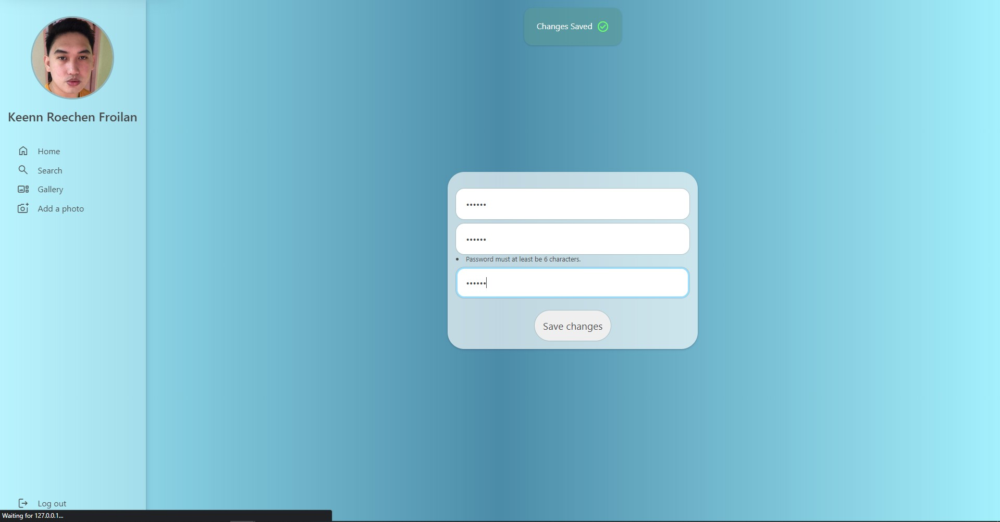<br><br>

## **SEARCH** 

Clicking on *Search* in the navigation sidebar will reveal a search bar located at the top of the page. You can search for any user in *Dogpack* by typing their name, surname, or username. You can search even if you input their information partially. This search is available from any page. *See the picture below*.  
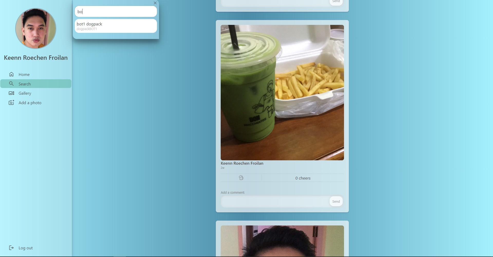  
Clicking on the search result will bring you to that user's profile.<br><br>

## **Gallery**  
 Clicking on *Gallery* in the navigation side bar will take the user to the *Gallery* page. All of the user's posts can be viewed in this page. 

 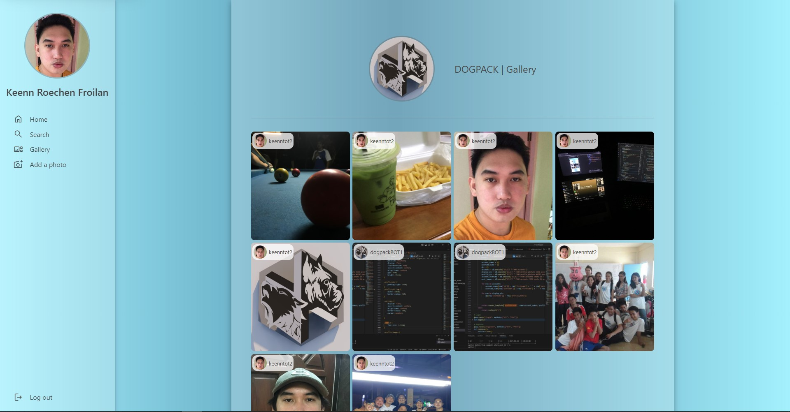  
 This is the Gallery page, with a layout similar to the Profile page. The only difference is a small icon containing the user's profile photo and username, allowing you to identify the user who posted that specific image *(post)*.

 You can also visit the post, similar to the *Profile page*, by clicking on the image. *See the picture below*.  
  <br><br>

## **Add a Photo (post)**  

Clicking on *Add a photo* in the navigation bar will take the user to the *Add photo* page.

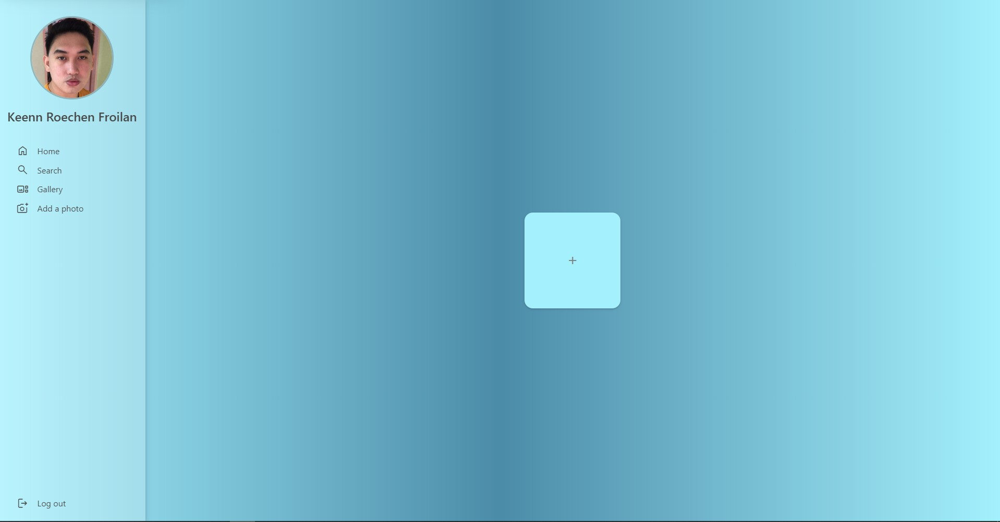  
This is the *Add photo* page. When you first go to the *Add photo* page, a plus (+) sign is displayed. When clicked, it will prompt the user to select a photo.  

If the user has already selected a photo, they can adjust it to their desired result by dragging and zooming. The user also has the option to add a caption to the photo or leave it blank. *See the picture below*.  
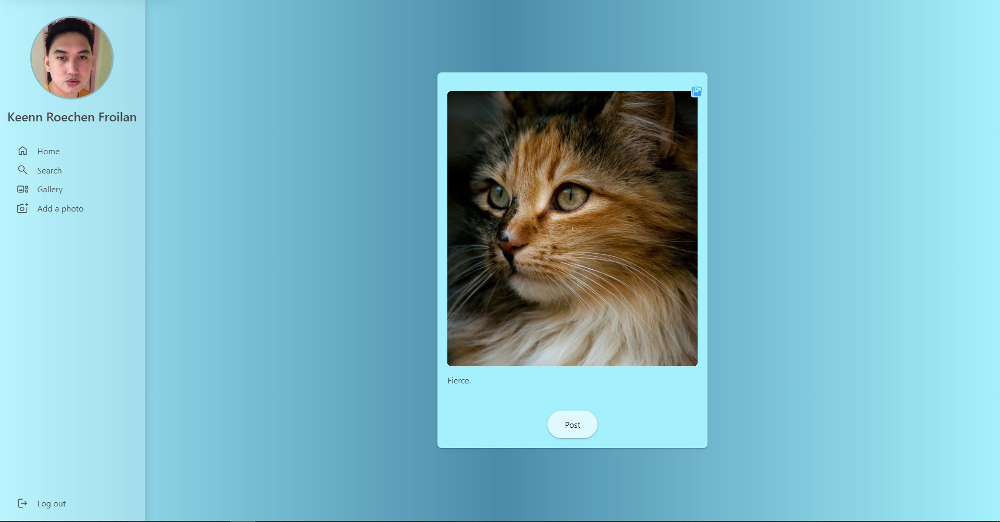  
If the user wants to choose a different photo, they can simply click the *Change photo* icon located in the upper right corner of the photo. If the user is satisfied with the adjustments, clicking the 'Post' button will publish the post and automatically return them to the *Homepage*.

Upon clicking the *Post* button, the image is saved in a directory, and the caption is saved in the database.  It is crucial that there are no images with the same filename in the directory. To ensure this, I have implemented a function that automatically increments the filename if an image with the same name already exists in the directory. *Please see the code block below*.

```JavaScript
$(document).on('click', '.submit input', function(e) {
    e.preventDefault()
    let input_caption = $('.inputcaption').text()
    image_data = cropper.getCroppedCanvas().toDataURL('image/' + file_ext)
    a = $.ajax({
        url: '/add-photo-ajax',
        type: 'POST',
        contentType: 'application/json', 
        data: JSON.stringify({'caption' : input_caption, 'image_data' : image_data.split(',')[1], 'filename' : photo_filename}),
        success: function() {
            window.location.pathname = '/'
        }
    })
})
```
*Refer to the code block above*. When the *Post* button is clicked, an AJAX call is made, passing data to the server. These data are the *caption*, *image* (in Base64 - encoded string), and the *filename*.  

```python
# Add photo via Ajax
@app.route('/add-photo-ajax', methods=['POST', 'GET'])
@login_required
def add_photo_ajax():

    if request.content_type:
        image_data = request.get_json()
        caption = image_data['caption']
        photo = image_data['image_data']
        filename = image_data['filename']
        if isPhoto(filename):
            new_filename = filename_autoincrement(photo, filename, session.get('user_id'))
            # Update addphoto form to database
            db.execute('INSERT INTO posts (user_id, photo, caption, post_date, post_time) VALUES (?, ?, ?, ?, ?)', session.get('user_id'), new_filename, caption, datetoday(), timenow())
            return jsonify({'result' : 'success'})
    return redirect('/add-photo')
```
The data are the received by the server. Before saving the the file (photo) to the directory, it must ensure that the file is an image. For this reason, I implemented a function called *isPhoto*. *See the code below*.

```python
def isPhoto(filename):

    file_ext = os.path.splitext(filename)[1]

    ext = ['.jpg', '.jpeg', '.png', '.gif', '.svg']
   
    if file_ext in ext:
        return True
    return False
```
The *isPhoto* function accepts the image filename as its argument and verifies whether the file extension matches one of the specified image extensions in the list.  

```python
def filename_autoincrement(photo, filename, user_id):
path = f'static/images/{user_id}'
# checks if filename exists
if os.path.exists(f'{path}/{filename}'):
    file = os.path.splitext(filename)

    i = 1
    new_filename = file[0] + '_' + str(i) + file[1]
    # increments filename
    while new_filename in os.listdir(path):
        i += 1
        new_filename = file[0] + '_' + str(i) + file[1]
    with open (f'./static/images/{user_id}/{new_filename}', 'wb') as img:
        img.write(base64.b64decode(photo))
    return new_filename
with open (f'./static/images/{user_id}/{filename}', 'wb') as img:
    img.write(base64.b64decode(photo))
return filename
```

The *filename_autoincrement* function will take three (3) arguments: *photo* in Base64-encoded image string, *filename*, and *user_id*. This function is responsible for saving the image to a directory and, if a file with the same name already exists, it returns an incremented filename for use in the database.<br><br>

## **Log out**
You can log out from Dogpack by clicking on the *log out* option in the navigation bar or accessing the log-out function in the settings. Once clicked, the session is cleared, and the user will automatically be brought back to the *Login* page. *See the code block below*.

```python
# Logout
@app.route("/logout")
def logout():
    session.clear()
    return redirect("/login")
``` 
<br>

## **MOBILE**

Dogpack is a responsive website, ensuring that you can easily access it on your mobile devices. *See the pictures below*.

**Login**  

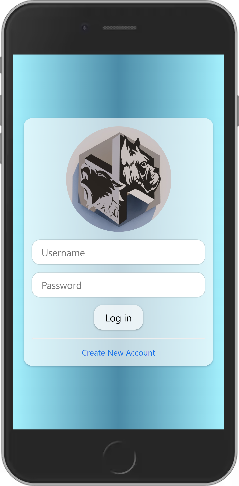<br><br>

**Register**  

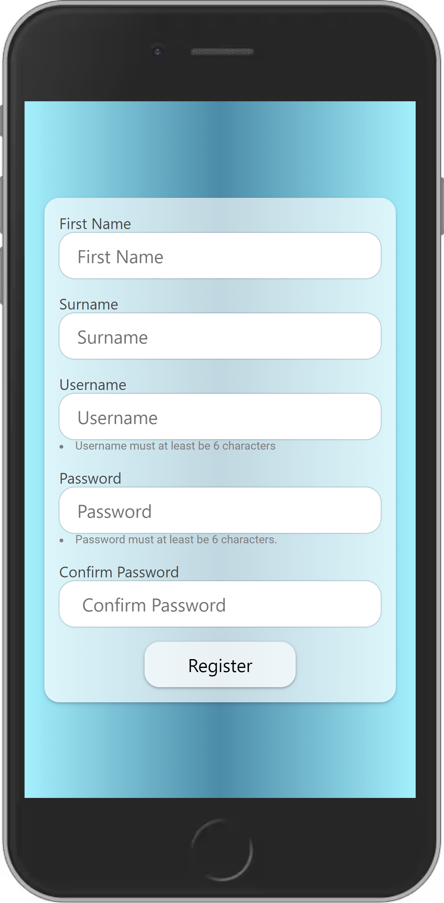<br><br>

**Homepage**  

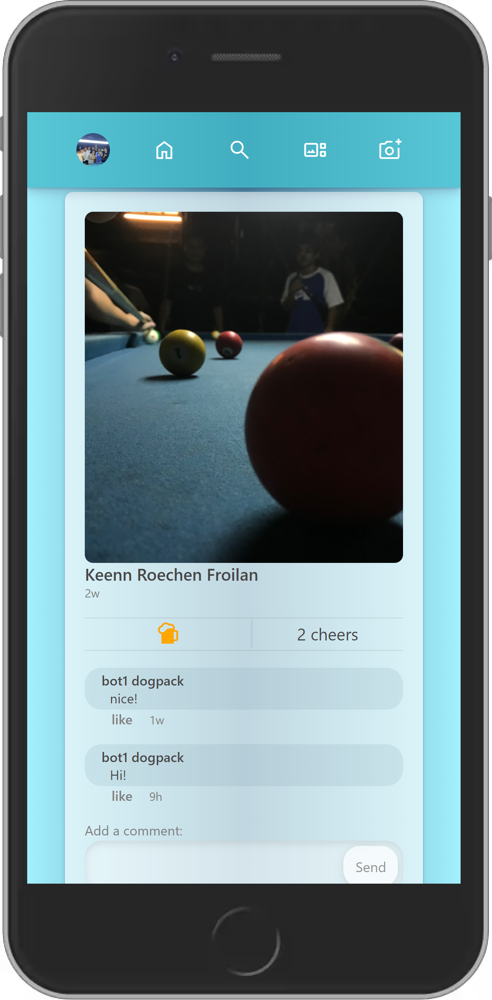<br><br>

**Profile**  

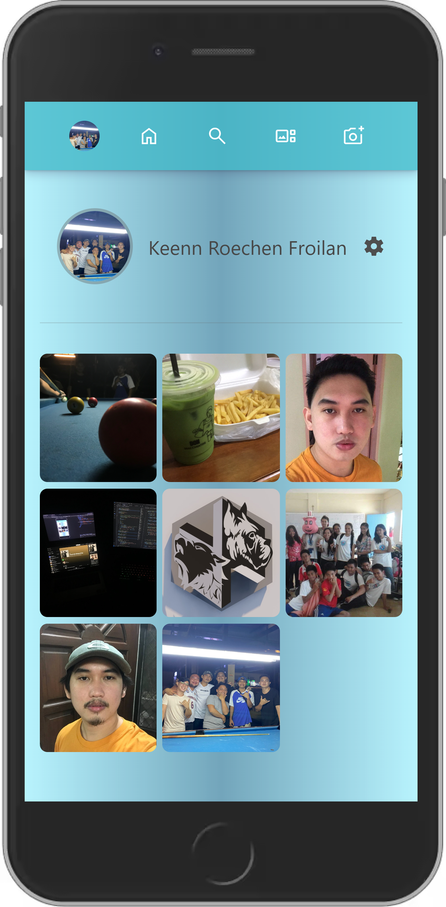<br><br>

**Profile (posts)**  

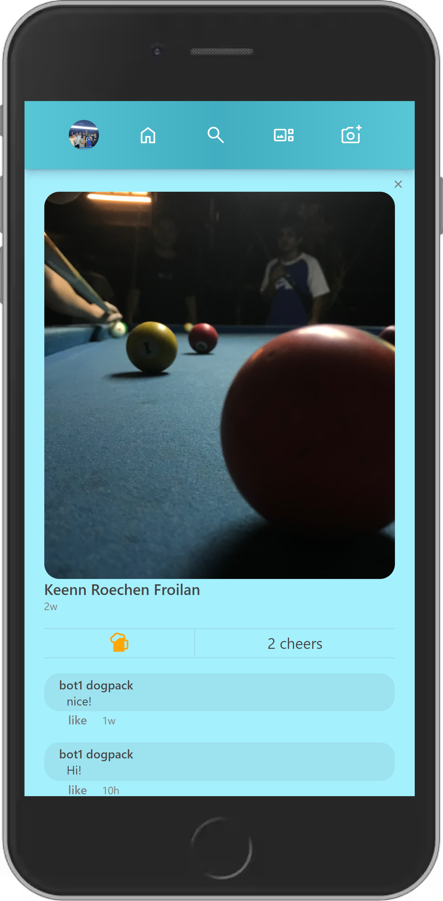<br><br>

**Profile (Change profile photo)**  

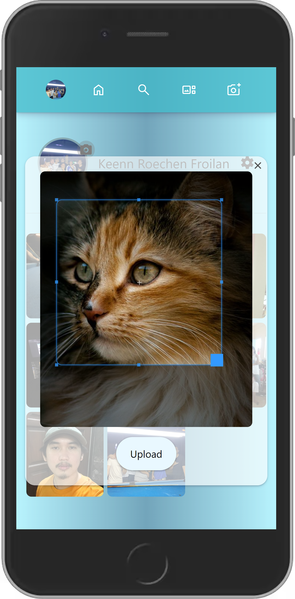<br><br>

**Profile (Change password)**  

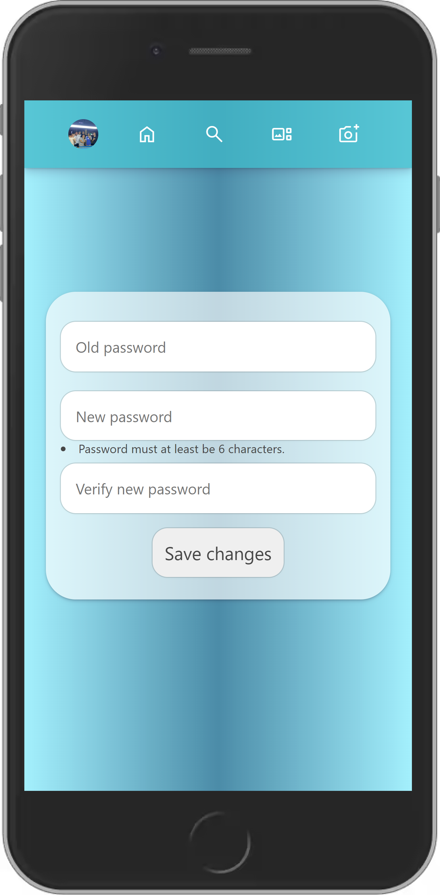<br><br>

**Search**  

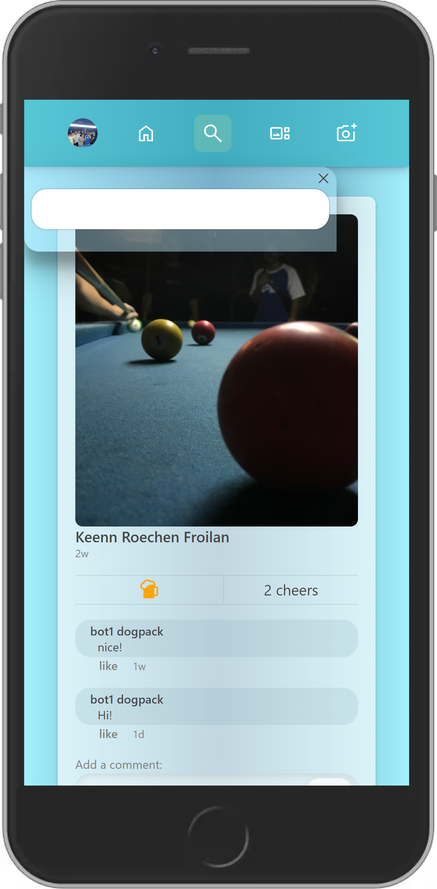<br><br>

**Gallery**  

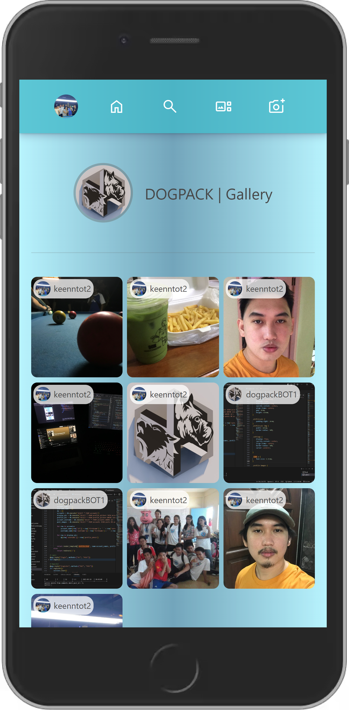<br><br>

**Add a photo**  

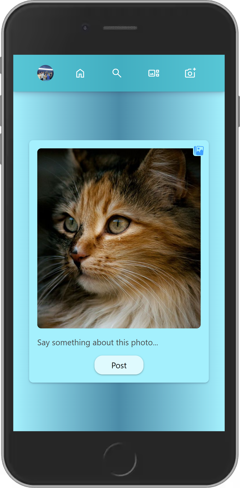<br><br><br>


#### *I want to express my gratitude to the CS50 team, especially to Professor David J. Malan.*  

#### *Contact me:*  
* *Email: froilankeenn@gmail.com*
* *Github: https://github.com/keenntot2*
